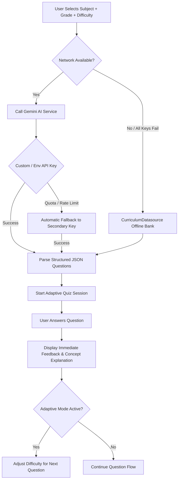

# ⚡ BrightSpark Self-Review
### *AI-Powered Adaptive Quiz Master for K-12*

> **BrightSpark Self-Review** is an intelligent, gamified learning companion built with Flutter and Riverpod. Powered by **Google Gemini AI**, it dynamically generates grade-calibrated, adaptive review questions with instant pedagogical feedback for K-12 students across all primary and secondary grade levels.
>
> 👨‍💻 **Lead Developer & Creator**: **Mark Joeven Orpilla**

---

## 🎯 What This App Is All About

### 1. Problem It Solves
Traditional quiz apps rely on static, repetitive question banks that quickly become stale or fail to match a student's actual learning pace. Students get either frustrated by questions that are too hard or bored by questions that are too easy.

### 2. The BrightSpark Solution ("Focused Play")
BrightSpark merges **academic rigor** with the engagement of **tactile gameplay**:
- **Adaptive AI Engine**: Dynamically generates fresh multiple-choice questions aligned with standard K-12 curricula (Primary G1–G3, Intermediate G4–G6, Junior High G7–G10, and Senior High G11–G12).
- **Difficulty Calibration**: Supports **Easy**, **Medium**, **Hard**, and **AI Adaptive Mode** (which scales difficulty in real-time based on consecutive right/wrong answers).
- **Pedagogical Explanations**: Every question includes a rich concept explanation and rationale so students learn *why* an answer is correct immediately.
- **Offline Reliability**: Built-in curriculum fallback datasource ensures the app works seamlessly even without an internet connection or API quota.
- **Gamification & Analytics**: Students earn badges (e.g., *Math Prodigy*, *Streak Master*, *Quiz Titan*), track mastery percentages per subject, and review quiz history.

---

## 🏗️ System Architecture & Tech Stack

```
lib/
├── main.dart                          # App entry point, ProviderScope, Router & Theme
├── core/
│   ├── constants/                     # Colors (Academic Play palette), typography & assets
│   ├── models/                        # Question, Session, Badge, Subject & Grade models
│   ├── providers/                     # Global Riverpod state providers
│   ├── services/
│   │   ├── gemini_ai_service.dart     # Google Gemini API client with auto dual-key fallback
│   │   └── storage_service.dart       # SharedPreferences persistence (offline history, profile)
│   └── theme/
│       └── app_theme.dart             # Material 3 light theme tokens
├── data/
│   ├── datasources/
│   │   └── curriculum_datasource.dart # Offline fallback question repository
│   └── repositories/
│       ├── quiz_repository.dart       # Coordinates AI generation with offline fallback
│       └── user_repository.dart       # Manages user profile, mastery metrics & history
└── features/
    ├── splash/                        # Animated mascot splash screen
    ├── welcome/                       # Subject picker & student profile onboarding
    ├── grade_level/                   # Category cards (Primary, Intermediate, JHS, SHS)
    ├── difficulty/                    # Mode selection (Easy, Medium, Hard, Adaptive)
    ├── quiz/                          # Active quiz loop, timer, option cards & explanations
    ├── result/                        # Confetti celebration, performance breakdown & rewards
    ├── navigation/                    # Persistent bottom navigation shell
    ├── badges_tab/                    # Achievement badges & unlock criteria
    ├── progress_tab/                  # Subject mastery analytics & charts
    ├── quizzes_tab/                   # Complete attempt history & review
    ├── rank_tab/                      # Leaderboards & competitive ranking
    └── settings/                      # API key configuration, audio, and About modal
```

---

## 🤖 AI Engine Workflow (`gemini_ai_service.dart`)



---

## 🎨 Design Philosophy: *"Academic Play"*

The visual identity is documented in [`academic_play/DESIGN.md`](./academic_play/DESIGN.md):
- **Colors**: High-energy yet friendly palette using `#0058be` (Trust Blue), `#ffc329` (Reward Gold), and `#00855b` (Success Mint).
- **Typography**: **Quicksand** for bold, rounded headlines paired with **Nunito Sans** for readable body and explanations.
- **Micro-Interactions**: Tactile button presses, bounce animations, and celebratory confetti overlay.

---

## 🚀 Running & Building

### 1. Run on Localhost (Web)
```powershell
flutter run -d chrome
# or
flutter run -d web-server --web-port=8080 --web-hostname=localhost
```

### 2. Build Android APK
```powershell
flutter build apk --debug
# or release
flutter build apk --release
```

### 3. Run Static Code Analysis
```powershell
flutter analyze
```
